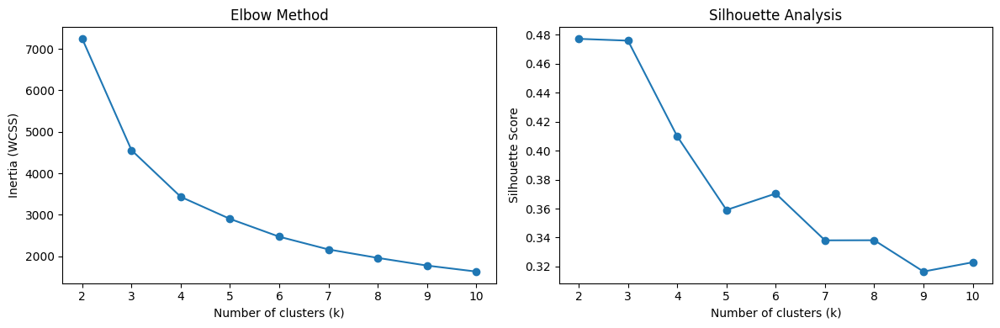
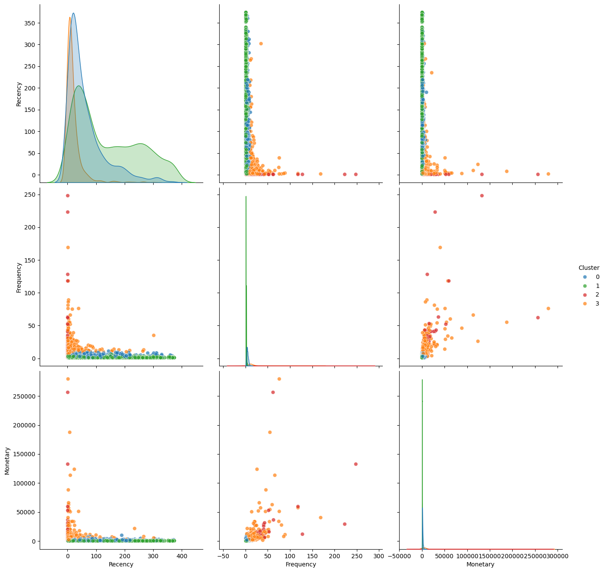

# Customer Segmentation using RFM Analysis

This project performs **customer segmentation** using **Recency, Frequency, and Monetary (RFM)** analysis to identify meaningful customer groups and enable data-driven marketing and retention strategies.

---

## Problem Statement

Businesses often treat all customers the same, leading to inefficient marketing spend and poor retention outcomes.  
The goal of this project is to segment customers based on purchasing behavior so that **targeted actions** can be designed for different customer groups.

---

## Dataset

- Transaction-level retail data
- Key fields used:
  - `CustomerID`
  - `InvoiceDate`
  - `InvoiceNo`
  - `Quantity`
  - `UnitPrice`

Cancelled transactions are retained to correctly compute **net monetary value**.

---

## Methodology

### 1. Data Cleaning & Preparation
- Removed rows with missing `CustomerID`
- Converted `InvoiceDate` to datetime
- Created `TotalPrice = Quantity × UnitPrice`
- Preserved negative quantities to account for cancellations

---

### 2. RFM Feature Engineering
For each customer:
- **Recency**: Days since last purchase
- **Frequency**: Number of unique invoices
- **Monetary**: Total net spend

A reference date of *last invoice date + 1 day* was used.

---

### 3. Skewness Handling & Scaling
- Frequency and Monetary showed strong right skew
- Log transformation was applied to reduce dominance of extreme values
- Features were standardized using `StandardScaler` to support distance-based clustering

---

### 4. Optimal Cluster Selection

Two complementary methods were used:

- **Elbow Method** to identify diminishing returns in within-cluster variance
- **Silhouette Score** to evaluate cluster separation

**Elbow Method & Silhouette Analysis (side-by-side)**  

Based on stability and interpretability, **k = 4** was selected.

---

### 5. KMeans Clustering
- Algorithm: KMeans
- Number of clusters: 4
- Random state fixed for reproducibility

---

### 6. Cluster Visualization

Clusters were visualized using pairwise plots of RFM features to validate behavioral separation.

 
**RFM Pairplot Colored by Cluster**  

---

## Cluster Interpretation & Business Meaning

### Cluster 0 — Champions
**Profile**
- Very recent purchases  
- High purchase frequency  
- High monetary value  

**Business Meaning**  
Top-value customers who drive a disproportionate share of revenue.

**Recommended Actions**
- VIP programs
- Early access to products
- Strong retention focus

---

### Cluster 1 — Loyal Customers
**Profile**
- Frequent purchases
- Moderate monetary value
- Relatively recent activity  

**Business Meaning**  
Consistent customers with potential to become high-value.

**Recommended Actions**
- Upsell and cross-sell
- Loyalty rewards
- Bundled offers

---

### Cluster 2 — At-Risk Customers
**Profile**
- Long time since last purchase
- Low frequency
- Low monetary value  

**Business Meaning**  
Customers likely to churn without intervention.

**Recommended Actions**
- Win-back campaigns
- Personalized discounts
- Re-engagement emails

---

### Cluster 3 — New / One-Time Customers
**Profile**
- Recent purchase
- Low frequency
- Low monetary value  

**Business Meaning**  
Newly acquired customers with limited history.

**Recommended Actions**
- Onboarding campaigns
- Incentives for second purchase
- Reduce friction in repeat buying

---

## Key Takeaways

- RFM-based clustering provides **actionable customer segments**
- Log transformation and scaling are critical for stable clustering
- Cluster interpretation is as important as the algorithm itself
- The output directly supports **marketing, retention, and growth decisions**

---

## Notes

This project focuses on **interpretability and business relevance**, not just model output.  
Clustering is treated as a **decision-support tool**, not an end in itself.

