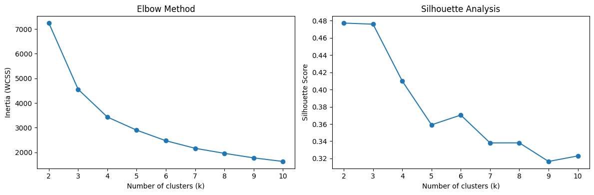
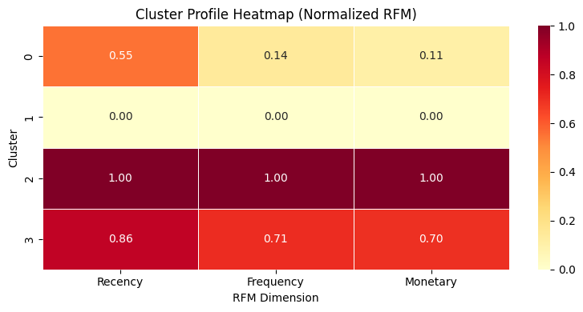
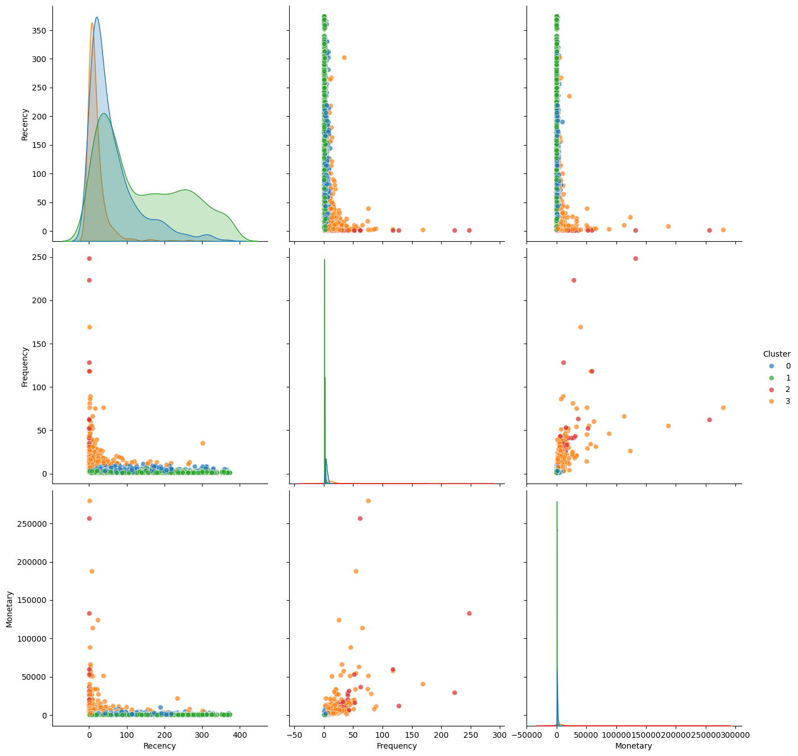

# Customer Segmentation using RFM Analysis


Segment e-commerce customers into actionable behavioral groups using Recency, Frequency, and Monetary (RFM) analysis with KMeans clustering — enabling targeted marketing, retention, and growth decisions.

---

## Table of Contents

- [Project Overview](#project-overview)
- [Repo Structure](#repo-structure)
- [Dataset](#dataset)
- [Methodology](#methodology)
- [Results](#results)
- [Visualizations](#visualizations)
- [Reproducibility](#reproducibility)
- [Requirements](#requirements)
- [How to Run](#how-to-run)
- [License](#license)

---

## Project Overview

Businesses that treat all customers identically waste marketing spend on low-value segments and under-invest in high-value ones. This project addresses that by segmenting customers based on actual purchasing behavior — not demographics or assumptions.

RFM analysis distills transaction history into three dimensions per customer: how recently they bought, how often, and how much. KMeans clustering then groups customers with similar behavioral profiles, producing segments that are both statistically separable and directly actionable by a marketing or CRM team.

---

## Repo Structure

```
customer-segmentation/
├── Customer_Segmentation.ipynb   # Main notebook
├── customer_segmentation.py      # Script version
├── OnlineRetail.csv              # Raw dataset (not tracked)
├── images/
│   ├── elbow_silhouette.png
│   ├── rfm_pairplot.png
│   └── cluster_heatmap.png
└── README.md
```

---

## Dataset

**Source:** UCI Online Retail Dataset (public)

UK-based online retailer, December 2010 to December 2011.

| Property | Value |
|---|---|
| Raw rows | ~541,909 |
| Customers after cleaning | 4,322 |
| Date range | Dec 2010 – Dec 2011 |
| Geography | Primarily UK |

**Key fields used:** `CustomerID`, `InvoiceDate`, `InvoiceNo`, `Quantity`, `UnitPrice`

Cancelled transactions (negative quantities) are retained to correctly compute net monetary value per customer. Rows with missing `CustomerID` and `UnitPrice <= 0` are removed. Customers with net negative monetary value are excluded from clustering.

---

## Methodology

### 1. Data Cleaning

- Dropped rows with missing `CustomerID`
- Filtered `UnitPrice > 0` to remove credit adjustments and test entries
- Computed `TotalPrice = Quantity × UnitPrice`, preserving negative quantities for cancellation correction

### 2. RFM Feature Engineering

For each customer, three behavioral features were computed using a reference date of last invoice date + 1 day:

- **Recency** — days since last purchase
- **Frequency** — number of unique invoices
- **Monetary** — total net spend in GBP

### 3. Skewness Handling & Scaling

All three features showed strong right skew:

| Feature | Skewness |
|---|---|
| Recency | 1.27 |
| Frequency | 11.35 |
| Monetary | 21.60 |

Frequency and Monetary were log-transformed (`log1p`) to reduce dominance of extreme values.

Recency was transformed as `1/Recency` rather than log. This inverts the scale so that higher values correspond to more recent purchases, making clustering distance semantically consistent — customers who bought recently are closer together in feature space.

All features were then standardized using `StandardScaler`.

### 4. Optimal Cluster Selection

Two complementary methods were used to select k:

- **Elbow Method** — identifies diminishing returns in within-cluster variance (WCSS)
- **Silhouette Score** — measures cluster separation and cohesion

The silhouette curve peaks at k=2 and k=3 (≈0.48), then drops at k=4 (0.41). Despite the lower silhouette score, **k=4 was selected** because it produces four behaviorally distinct and independently actionable segments. k=2 and k=3 collapse meaningful distinctions — for example, merging Champions and Loyal customers into a single group loses the ability to treat them differently.

### 5. KMeans Clustering

- Algorithm: KMeans
- Clusters: 4
- `random_state=108`, `n_init=10` for reproducibility and initialization stability

---

## Results

### Cluster Profiles

| Cluster | Label | Recency (days) | Frequency (invoices) | Monetary (£) | Customers |
|---|---|---|---|---|---|
| 2 | **Champions** | 1 | 21.8 | £10,096 | 105 |
| 3 | **Loyal High-Value** | 20 | 15.8 | £7,138 | 626 |
| 0 | **Occasional Buyers** | 63 | 4.3 | £1,345 | 1,614 |
| **1** | **Lapsed / At-Risk** | **139** | **1.5** | **£310** | **1,977** |

> **Silhouette score at k=4: 0.4098** — moderate separation, reflecting the trade-off between cluster quality and business interpretability. k=2 and k=3 yield higher silhouette scores (≈0.48) but collapse actionable distinctions between segments.

### Segment Interpretation & Recommended Actions

**Cluster 2 — Champions** (105 customers, 2.4% of base)
These are the highest-value customers by every measure — bought within the last day on average, transact over 20 times, and spend over £10k. They drive a disproportionate share of revenue despite being the smallest segment.
Recommended actions: VIP programs, early product access, strong retention focus, referral incentives.

**Cluster 3 — Loyal High-Value** (626 customers, 14.5% of base)
Recent, frequent buyers with high spend. Behaviorally close to Champions but with lower frequency and monetary value. High potential for conversion to Champions with the right nudge.
Recommended actions: upsell and cross-sell, loyalty rewards, bundled offers, personalized recommendations.

**Cluster 0 — Occasional Buyers** (1,614 customers, 37.3% of base)
Bought within the last two months but with low frequency and modest spend. The largest actionable segment — the goal is to increase purchase frequency before they lapse.
Recommended actions: re-engagement offers, frequency-based incentives, category expansion campaigns.

**Cluster 1 — Lapsed / At-Risk** (1,977 customers, 45.7% of base)
Nearly 140 days since last purchase, very low frequency, minimal spend. The largest segment by count but lowest value. High churn risk.
Recommended actions: win-back campaigns, personalized discounts, re-engagement emails. Prioritize selectively — blanket campaigns on this segment are expensive relative to expected return.

---

## Visualizations

**Elbow Method & Silhouette Analysis**



The elbow appears between k=3 and k=4. The silhouette curve peaks at k=2–3, then stabilizes. k=4 balances cluster quality with segment actionability.

---

**Cluster Profile Heatmap (Normalized RFM)**



Recency is inverted in the heatmap (higher = more recent) so that dark red consistently means strong performance across all three dimensions. Cluster 2 (Champions) scores 1.00 across all dimensions. Cluster 1 (Lapsed) scores 0.00 across all dimensions — confirming clean separation at the extremes.

---

**RFM Pairplot Colored by Cluster**



Champions (Cluster 2, red) are clearly separated in Frequency and Monetary space. Lapsed customers (Cluster 1, green) cluster tightly near zero on both axes. Occasional Buyers (Cluster 0, blue) and Loyal High-Value (Cluster 3, orange) overlap in Recency but separate on Frequency and Monetary.

---

## Reproducibility

All results are fully reproducible with fixed seeds.

- KMeans: `random_state=108`, `n_init=10`
- No stochastic elements outside KMeans initialization
- Dataset is public: UCI Online Retail Dataset ([download here](https://archive.ics.uci.edu/ml/datasets/Online+Retail))

---

## Requirements

```
pandas
numpy
scikit-learn
matplotlib
seaborn
```

Install with:

```bash
pip install pandas numpy scikit-learn matplotlib seaborn
```

---

## How to Run

1. Download `OnlineRetail.csv` from the UCI repository and place it in the project root
2. Open `Customer_Segmentation.ipynb` in Jupyter or Google Colab
3. Run all cells in order

Or run the script version:

```bash
python customer_segmentation.py
```

---

## Key Takeaways

- The top two segments (Champions + Loyal High-Value) represent only 17% of customers but are responsible for the vast majority of revenue — classic Pareto distribution in retail.
- `1/Recency` transformation is a deliberate semantic choice, not a default. It ensures that distance-based clustering treats recent buyers as similar to each other, which log transformation would not achieve.
- k=4 was chosen for interpretability over silhouette score. k=2 and k=3 produce cleaner separations statistically but collapse distinctions that matter for marketing decisions.
- The Lapsed segment (46% of customers) appears large but is low-ROI for broad campaigns. Selective win-back based on prior Monetary value is more defensible than blanket re-engagement.

---

## Failed Experiments

- **k=2 and k=3** — higher silhouette scores (≈0.48) but produced segments too coarse to be actionable. Champions and Loyal customers collapsed into a single group.
- **Log transformation on Recency** — technically valid for skew reduction but semantically wrong for clustering. `1/Recency` was used instead to preserve directional meaning in distance calculations.

---

## Limitations

- The dataset covers a single year (Dec 2010 – Dec 2011) from one retailer. Cluster boundaries may shift significantly with different seasonality patterns or business types.
- KMeans assumes spherical clusters of roughly equal variance. The Champions segment (105 customers) is far smaller than Lapsed (1,977), which can create instability in centroid positioning.
- Segment labels (Champions, Lapsed etc.) are assigned post-hoc based on cluster means. They are interpretive, not algorithmic — a different analyst might label them differently.
- No temporal validation: the model is trained on the full period. A rolling window or holdout period would be needed to validate whether the segments are stable over time.

---

## License

MIT
